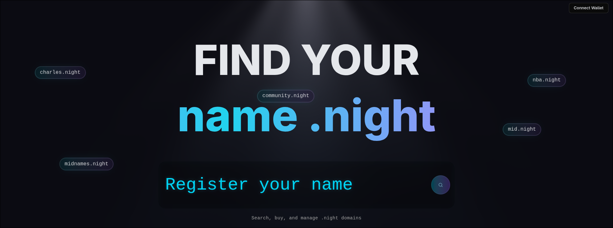
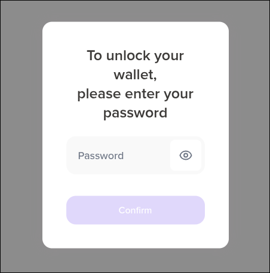
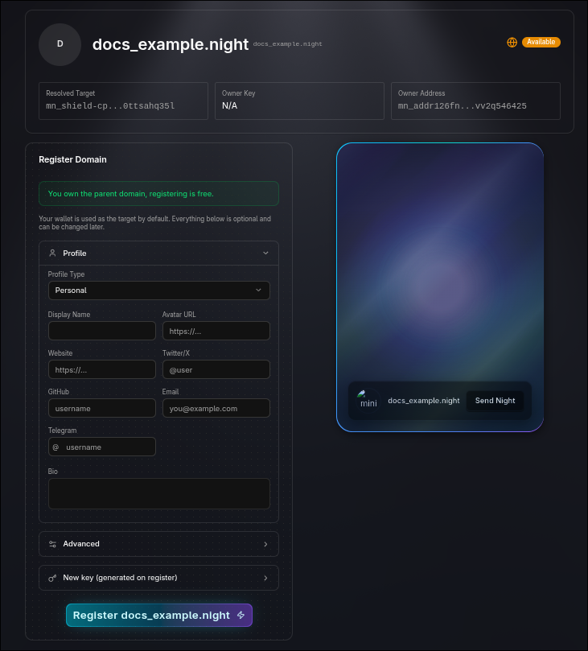
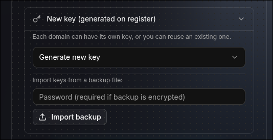
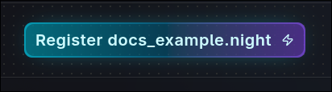
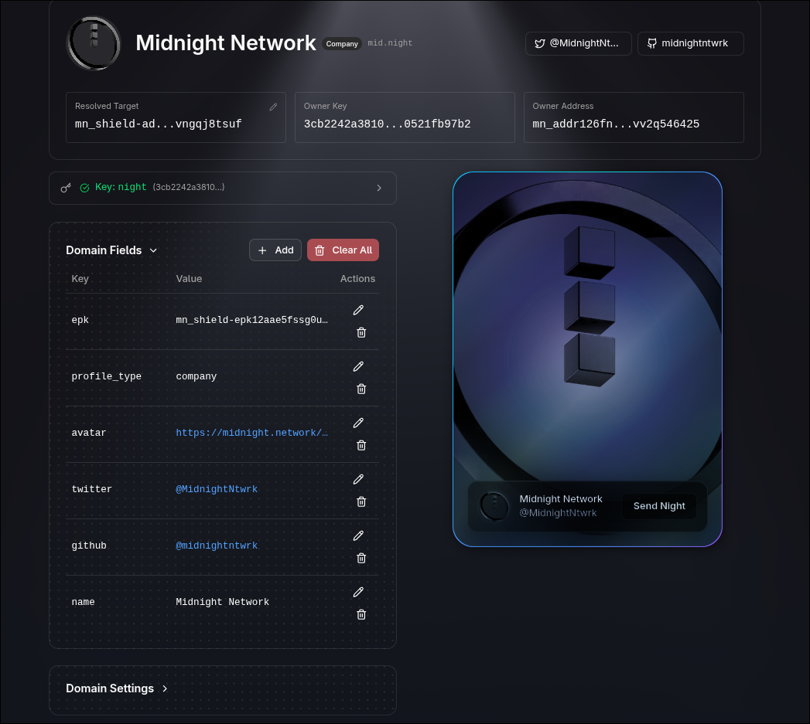

import { Aside, Steps } from "@astrojs/starlight/components";

In this guide, we will walk you through the steps to buy a `.night` domain using <a href="https://midnight.domains" target="_blank">Midnight Domains</a>, the domain registrar for the Midnight Network.

## Steps :badge[Start here!]

<Steps>

1. Install <a href="https://docs.midnight.network/develop/tutorial/using/chrome-ext" target="_blank">Lace for Midnight</a> or any other wallet that supports the Midnight Network.

   You need to have DUST in your wallet, and the tokens required until Midnight Network enables the use of the native token. Yo can get them in <a href="https://get.midnight.domains" target="_blank">https://get.midnight.domains</a>.

2. Go to <a href="https://midnight.domains" target="_blank">https://midnight.domains</a>

   

3. You should see a popup asking your wallet password to connect the wallet to Midnight Domains.

   

4. Search for your desired <b>.night</b> domain in the search bar.

   

   If the domain is already taken, you will see the profile of the current owner.

5. _(Optional)_ If the domain is available, you can customize the fields and target for your domain.

6. If this is the first domain you are buying, you need to set a new key that manages your domain. You can use the same key for all your domains, but you need to set it up at least once.

   <Aside type="danger">
     <b>Important:</b> Make sure to backup the key you are setting up, as it is required to manage your domain. If you lose it, you will lose access to your domain.
   </Aside>

   

6. Click on the <b>Register \[domain.night\]</b> button.

   

   You'll see a wallet popup asking you to confirm the transaction. 

7. After confirming the transaction, you will see your profile!.

   

</Steps>
