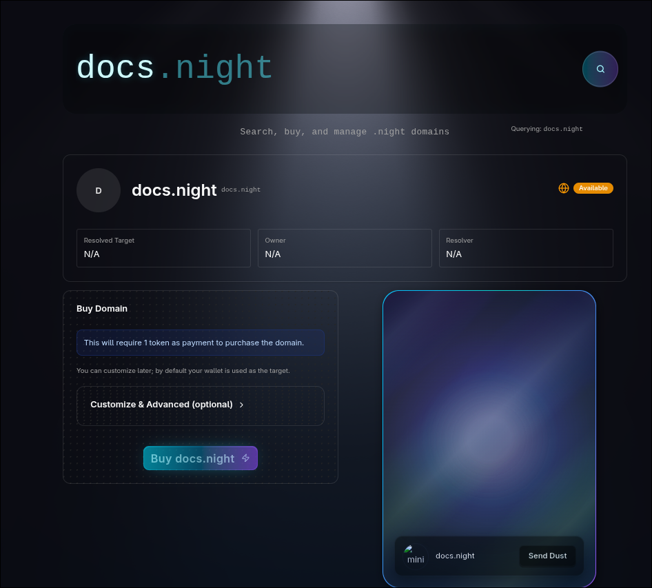
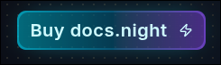
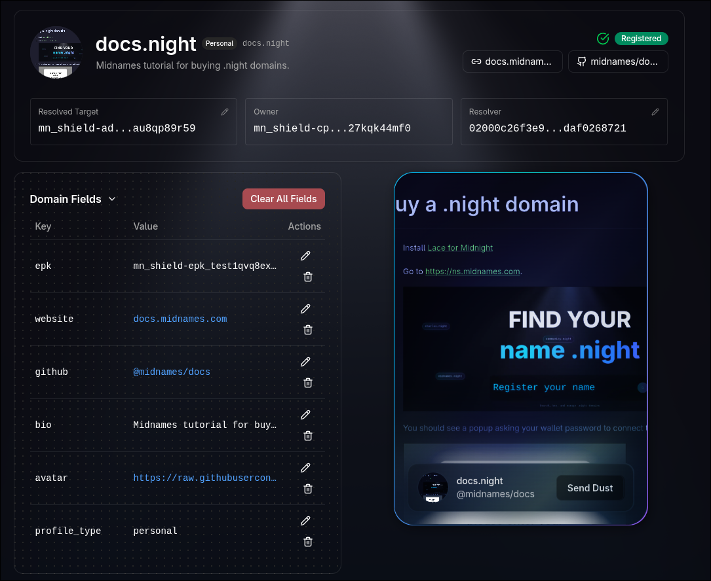

import { Aside, Steps } from "@astrojs/starlight/components";

In this guide, we will walk you through the steps to buy a `.night` domain using <a href="https://ns.midnames.com" target="_blank">Midnames</a>, the domain registrar for the Midnight Network.

## Steps :badge[Start here!]

<Steps>

1. Install <a href="https://docs.midnight.network/develop/tutorial/using/chrome-ext" target="_blank">Lace for Midnight</a>

   Remember to fund your wallet using the <a href="https://midnight.network/test-faucet" target="_blank">Midnight Faucet</a>.

2. Go to <a href="https://ns.midnames.com" target="_blank">https://ns.midnames.com</a>

   

3. You should see a popup asking your wallet password to connect the wallet to Midnames.

   

4. Search for your desired <b>.night</b> domain in the search bar.

   

   If the domain is already taken, you will see the profile of the current owner.

5. _(Optional)_ If the domain is available, you can click the <b> Customize & Advanced </b> button to set custom records for your domain.

   <Aside type="note" title="Note">
     By default, Midnames will set the `TARGET` record to your
     `ZswapCoinPublicKey` (the `CoinPublicKey` of your wallet) and the `epk`
     record to the `EncriptionPublicKey` of your wallet. If both records are
     set, the target will be automatically set to the `mn_shield-addr_test...`
     address, instead of showing a `ZswapCoinPublicKey`.{" "}
   </Aside>

   Here's how the customization screen looks like:
   

   And this is the `TARGET` and `OWNER` fields previewed in the customization screen:
   

6. Click on the <b>Buy \[domain.night\]</b> button.

   

   At this point, you will see TWO subsequent popupus from your wallet asking you to confirm the transactions:

   - The first one is to deploy the domain contract.
   - The second one is to register it in the TLD.

7. After confirming both transactions, you will see your profile!.

   

</Steps>
