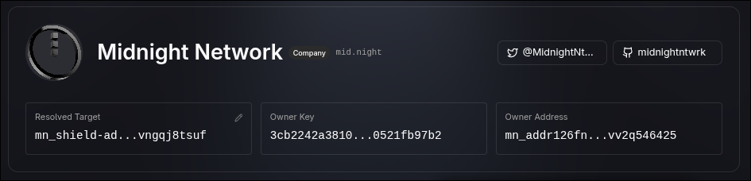
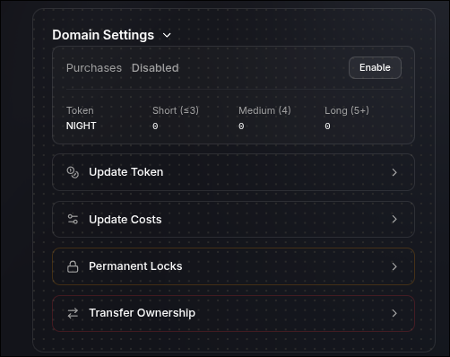
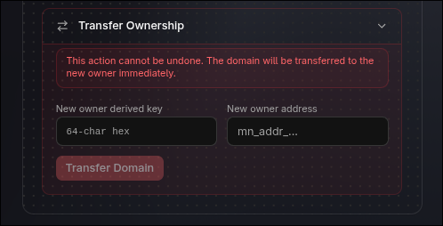

import { Aside, Steps } from "@astrojs/starlight/components";

Learn how to safely transfer your .night domain to another user on the Midnight Network. This process requires careful verification to ensure a successful transfer.

<Aside type="danger" title="Important: Transfers are permanent">
  Domain transfers cannot be undone. Once completed, you will no longer own the
  domain. Always double-check the recipient's address before confirming the
  transfer.
</Aside>

## Before You Start

Ensure you have:

- Any wallet that supports the Midnight Network.
- The wallet address of the recipient.
- The Owner Key of the recipient. This is the middle field in the domain profile header. You can ask the recipient to provide it to you, or you can find it another domain owned by the recipient. 

## Transfer Process

<Steps>

2. **Access domain settings**

   Scroll down to the **Domain Settings** section below the Domain Fields area.

   

3. **Open and fill the transfer form**

   In the transfer section:

   - Paste the recipient's Unshielded Address
   - Paste the recipient's Owner Key

    

4. **Review and confirm**

   - Review all details one final time
   - Confirm the recipient address is correct
   - Click **Transfer Domain**

   <Aside type="danger" title="Double-check recipient details">
     Verify again. If you transfer to the wrong address, you will lose your domain permanently.
   </Aside>

5. **Complete the transaction**

    After clicking **Transfer Domain**, you'll be requested to sign the transaction using your Lace Wallet. 
   - Sign the transaction with your Lace Wallet
   - Wait for confirmation
   - You'll see a success message when the transfer is complete

</Steps>

## Common Issues

**Transfer failed?**

- Verify the recipient address is valid
- Ensure you have sufficient funds in your Lace Wallet for transaction fees
- Check that your wallet is properly connected

**Need to cancel?**

- Transfers cannot be cancelled once executed. After signing the transaction, the transfer is permanent.
