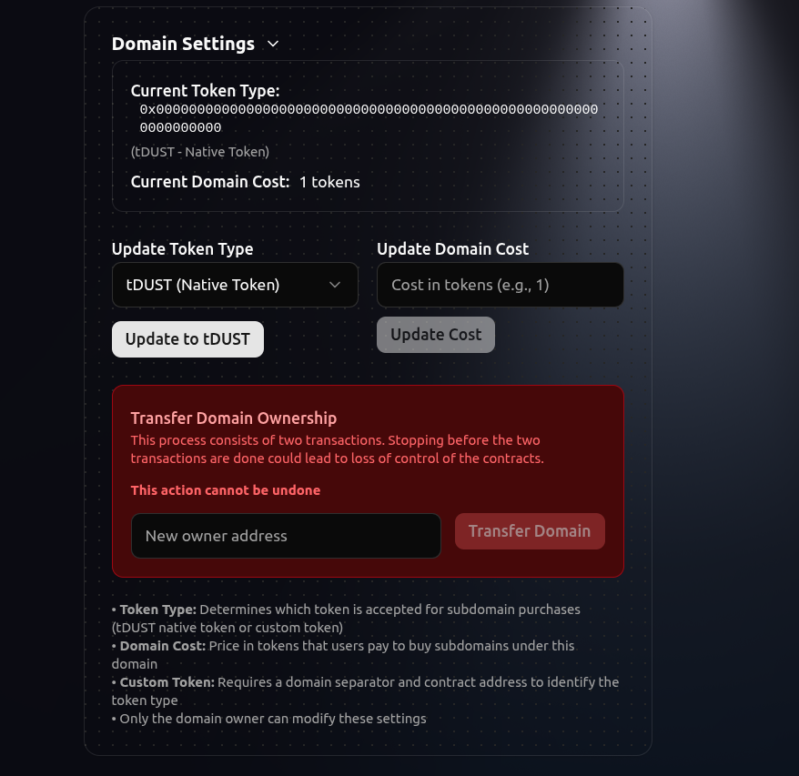
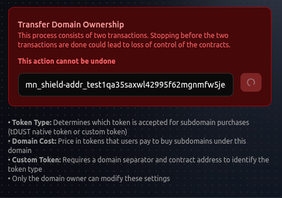

import { Aside, Steps } from "@astrojs/starlight/components";

Learn how to safely transfer your .night domain to another user on the Midnight Network. This process requires careful verification to ensure a successful transfer.

<Aside type="danger" title="Important: Transfers are permanent">
  Domain transfers cannot be undone. Once completed, you will no longer own the
  domain. Always double-check the recipient's address before confirming the
  transfer.
</Aside>

## Before You Start

Ensure you have:

- <a href="https://docs.midnight.network/develop/tutorial/using/chrome-ext" target="_blank">Lace Wallet for Midnight</a> installed
- The wallet address of the recipient

## Transfer Process

<Steps>

1. **Verify domain ownership**

   Midnames Nameservice verifies the ownership of the domain with your current wallet address. Once it is verified, you'll be allowed to transfer ownership to another address.

   

   **Look for**: Your wallet address or CoinPublicKey displayed as the current owner. If no `epk` field is set, by default the field shows the `cpk`.

2. **Access domain settings**

   Scroll down to the **Domain Settings** section below the Domain Fields area.

   

3. **Enter recipient address**

   In the transfer section:

   - Paste the recipient's wallet address
   - Double-check the address. Remember, this is irreversible

    

4. **Review and confirm**

   - Review all details one final time
   - Confirm the recipient address is correct
   - Click **Transfer Domain**

5. **Complete the transaction**

    After clicking **Transfer Domain**, you'll be requested to sign the transaction using your Lace Wallet. 
   <Aside type="note" title="Important: Two signatures required">
   **You will see TWO consequent wallet popups** that require your signature to complete the transfer. Both must be signed for the transaction to succeed. See the popup example below.
   </Aside>
   - Sign the transaction with your Lace Wallet
   - Wait for confirmation
   - Sign the second one
   - Wait for confirmation again
   - You'll see a success message when the transfer is complete

    
</Steps>

## Common Issues

**Transfer failed?**

- Verify the recipient address is valid
- Ensure you have sufficient funds in your Lace Wallet for transaction fees
- Check that your wallet is properly connected

**Need to cancel?**

- Transfers cannot be cancelled once executed. After signing the transaction, the transfer is permanent.
