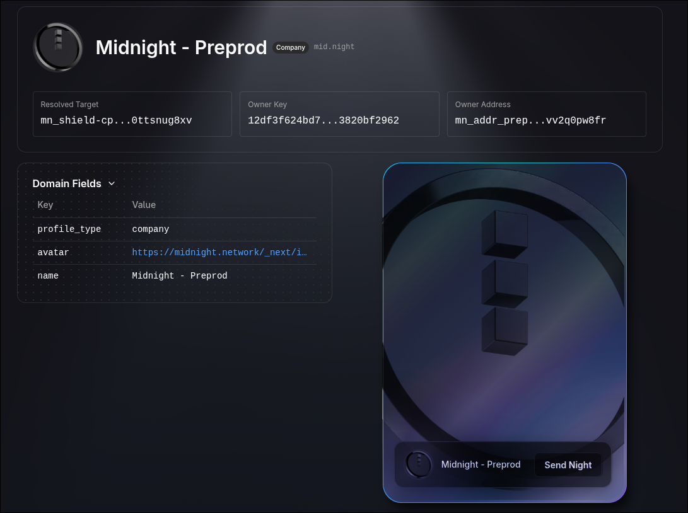

import { Aside, Steps } from "@astrojs/starlight/components";

<Aside type="caution">
  This guide targets the **preprod** environment. Domains registered here are not on mainnet and may be reset at any time. Use this environment for testing and development purposes only. 
</Aside>

In this guide you will connect your wallet to <a href="https://midnight.domains" target="_blank">midnight.domains</a> so you can register and manage `.night` domains on the preprod network. 

## Prerequisites

- A wallet that supports the Midnight Network (e.g. <a href="https://docs.midnight.network/develop/tutorial/using/chrome-ext" target="_blank">Lace for Midnight</a>).
- tNIGHT and tDUST tokens in your wallet for testing. You can get them from the <a href="https://faucet.preprod.midnight.network/" target="_blank">Midnight Faucet</a>.

## Steps

<Steps>

1. **Open the preprod app**

   Navigate to <a href="https://midnight.domains" target="_blank">https://midnight.domains</a>.

2. **Connect your wallet**

   You should click the "Connect Wallet" button, and then click the "Mainnet - change" button in the wallet popup to switch to preprod. After switching, connect your wallet to the site.

   <Aside type="note">
      Remember to switch your wallet to preprod before connecting.
   </Aside>

3. **Confirm you are on preprod**

   - Search for the `mid.night` domain in the search bar.

   

</Steps>
